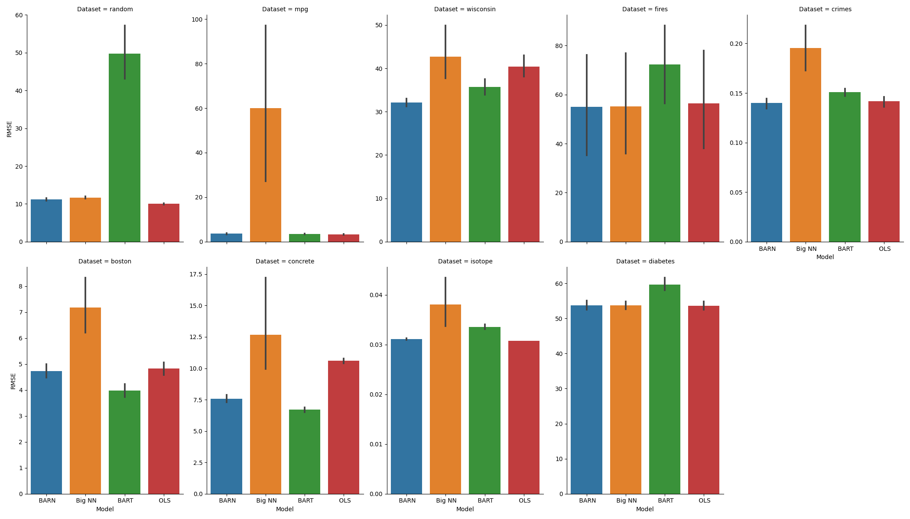

---
title: Born in a BARN
subtitle: Bayesian Additive Regression Networks
author:
- Daniel Van Boxel
date: Los Alamos - AZ Days, ~~16 May 2022~~ 15 Aug 2022
institute: University of Arizona
theme: AnnArbor
colortheme: albatross
fontsize: 10pt
aspectratio: 169
toc: true
toc-title: I Table of Contents
header-includes:
    - \definecolor{branch}{rgb}{0.33,.8,0.99}
    - \definecolor{leaf}{rgb}{0.1,.1,.1}
    - \definecolor{offwhite}{rgb}{0.9,.9,0.9}
    - \definecolor{tan}{rgb}{0.97,0.66,0.72}
    - \usecolortheme[named=leaf]{structure}
    - \setbeamercolor*{palette primary}{bg=branch, fg = leaf}
    - \setbeamercolor*{palette secondary}{bg=tan, fg = leaf}
    - \setbeamercolor*{palette tertiary}{bg=branch, fg = leaf}
    - \setbeamercolor*{palette quaternary}{bg=tan, fg = leaf}
    - \setbeamercolor*{titlelike}{bg=branch, fg = leaf}
    - \setbeamercolor*{section name}{bg=tan, fg = leaf}
    - \setbeamercolor*{subsection name}{bg=branch, fg = leaf}
    - \setbeamercolor*{part name}{bg=tan, fg = leaf}
    - \setbeamercolor*{background canvas}{bg=white, fg = black}
    - \setbeamercolor*{frametitle}{bg=branch, fg = leaf}
    - \setbeamercolor*{frametitle}{bg=tan, fg = leaf}
    - \setbeamercolor*{normal text}{bg=white, fg = black}
...

## High Level Overview

* *Concept*: Find a better method for regression models.
* *Implementation*: Adapt BART procedure to use MCMC to sample from space of neural network *models* conditioned on error.
* *Related Work*: Related Regression Techniques [@chipman2010bart; @breiman2001random], MCMC/Gibbs' [@metropolis1953equation; @geman1984stochastic]
* *Data*: UCI Benchmark regression problems [@dua2017uci], isotope measurement problem, [@roman2022bayclump]

# Background

## Regression Problem

::: columns

:::: {.column width=30%}

* Many numeric input variables, $x_i \in \mathbb{R}^d$
* Single continuous output, $y_i \in \mathbb{R}$
* Seek $f(x_i) \approx y_i$
* Ex: Linear regression, decision trees, neural networks, etc
::::
:::: {.column width=70%}

{ height=80% }

::::
:::

## Model Ensembling

::: columns

:::: {.column width=30%}

* Train many small models
* Individually weak, but together effective
* Tend to resist overfitting
* May require fewer parameters than a large model

::::
:::: {.column width=70%}

{ height=80% }

::::
:::

## Ensemble of Decision Trees: Random Forests [@breiman2001random]

::: columns

:::: {.column width=30%}

* Sample data points with replacement
* Each tree gets different sampling, build with CART
* Measure error of tree by how well it performs on unseen data (Out Of Bag error)
* Individual trees are unstable, but averaged are more general
* Overall performance tends to improve as well

::::
:::: {.column width=70%}

{ height=77% }

::::
:::

## Aside: Markov Chain Monte Carlo

::: columns

:::: {.column width=40%}

* Sample from some difficult to simulate probability distribution, $P(x)$
* Instead, simulate Markov process that has $P(x)$ as stationary distribution
* Propose new state and accept with probability, $A(x,x')$, to enforce stationary distribution
* From random initialization, step some number of *burn-in* iterations until convergence
* NB: Successive sample states are correlated

::::
:::: {.column width=60%}

![Share of probability from $x$ moving to $x'$ is equal to share from $x'$ moving to $x$ for all pairs of states, ensuring overall distribution is constant.  Figure from [@stepanov2021math]](balance.png){ height=80% }

::::
:::

$$ A(x, x') = min(1, \frac{q(x', x) P(x')}{q(x, x') P(x)})$$

## Another Forest: BART Basics [@chipman2010bart]

::: columns

:::: {.column width=30%}

* Bayesian Additive Regression Trees
* Sample prior distribution on tree parameters (e.g. depth)
* Trees *sum* to result (not average!)
* Train tree $i$ on $Y-\sum_{k \neq i} T_k$, residual of other trees
* MCMC to iteratively mutate trees to expected distribution

::::
:::: {.column width=70%}

{ height=77% }

::::
:::

## BART MCMC Process

::: columns

:::: {.column width=30%}

* Use of residual from fixed trees *conditions* on them, i.e. Gibbs' Sampling
* Propose mutation, $T'_j$ of tree, $T_j$.
* Compute posterior of model based on tree probability and fit

::::
:::: {.column width=70%}

{ height=60% }

::::
:::

$$ \alpha(T_j, T_j') = min(1, \frac{q(T_j', T_j) P(R_k|X,T_j') P(T_j')}{q(T_j, T_j') P(R_k|X,T_j) P(T_j)})$$

## Neural Networks

::: columns

:::: {.column width=30%}
* Take weighted sum of input for each node at layer $k+1$
* Apply nonlinear "activation" function
* $h_{j,k+1} = f(b_j + \sum w_{ij}h_{ik})$
* Next layer uses output of previous layer
* All calculations differentiable so we can apply gradient descent like algorithm
::::

:::: {.column width=70%}
{ height=80% }
::::

:::

# Methodology

## Bayesian Additive Regression Networks

::: columns

:::: {.column width=30%}
* Replace trees in BART with small NNs
* Sample from space of *networks* (architectures and weights)
* Same Gibbs' sampling, still additive
* Apply MCMC to new model proposal and acceptance
::::

:::: {.column width=70%}
{ height=80% }
::::

:::

$$ A(M_k, M_k') = min(1, \frac{q(M_k', M_k) P(R_k|X,M_k') P(M_k')}{q(M_k, M_k') P(R_k|X,M_k) P(M_k)})$$

## BARN Transition Probability

::: columns

:::: {.column width=30%}
* Based on model *architecture*
* All networks are simple 1 hidden layer with $m$ neurons
* Add new neuron with $q(m,m+1)=0.4$
* Remove last neuron with $q(m,m-1)=0.6$ (prefer smaller networks)
* *Retain previously learned weights!*
::::

:::: {.column width=70%}
{ height=80% }
::::

:::

## Prior Model Probability

::: columns

:::: {.column width=30%}
* Define prior model probability, $P(M_k)$ based on architecture
* Again encourage small size (want ensemble of weak/cheap models)
* Add new neuron with $p=0.4$
* Assume Poisson distribution ($\lambda =10$) on number of neurons:

$$ P(m) = \frac{\lambda^m e^{-\lambda}}{m!} $$

::::

:::: {.column width=70%}
![Poisson count probabilities (Image from [@wiki2022poisson])](poisson.png){ height=80% }
::::

:::

## Error Probability

::: columns

:::: {.column width=30%}
* After proposed model architecture determined, train new NN on *training residual*
* $R_k = Y - \sum_{j \ne k} M_j(X)$
* Assume errors normally distributed
* Compute likelihood over *validation* errors

::::

:::: {.column width=70%}

$$ P(R_k |X, M_k) = \prod_{i\in  valid} \frac{1}{\sigma \sqrt{\pi}} e^{-\frac{1}{2}\left(\frac{R_k^i-M_k(x_i)}{\sigma}\right)^2}$$

::::

:::

## Put It All Together

* Fix number of networks, $N=10$
* Initialize all networks to $M=1$ neuron and training on $R_k = \frac{Y}{N}$ (equal share)
* Gibbs' sample to propose/update one NN at a time with current residual
* Train proposed model, compute likelihood on validation data
* Accept/reject with $A$
* After burn-in period (each model has up to 100 updates), every step provides an ensemble of models, choose last/best (on validation)

# Results

## Data

::: columns

:::: {.column width=30%}
* Use benchmark regression problems from UCI [@dua2017uci]
* Similar to study of Neural Random Forests [@biau2019neural]
* Also created small random synthetic data set with 2 irrelevant features

::::

:::: {.column width=70%}

| Dataset | Features | Data Points |
|:----------|------:|---------:|
| boston | 13 | 506 |
| concrete | 9 | 1030 |
| crimes | 101 | 1994 |
| diabetes | 10 | 442 |
| fires | 10 | 517 |
| isotope | 1 | 700 |
| mpg | 7 | 398 |
| random | 10 | 1000 |
| wisconsin | 32 | 194 |

::::

:::

## Error Analysis

::: columns
:::: {.column width=30%}
* Batch means, compute $\phi = RMSE$ with validation data
* Typical within run variance $\leq 0.01$ run-to-run variance
* Example $\tau_{int} \approx 7 \ll 100$ samples

::::

:::: {.column width=70%}
{ height=80% }
::::

:::

## RMSE Accuracy

::: columns
:::: {.column width=25%}
* Compare to BART and equivalent size single big NN (i.e. $m = \sum m_k$)
* Compute $\bar{RMSE}(\sigma)$ over 13 independent runs
* BARN more stable and often more accurate

::::

:::: {.column width=75%}

| Dataset   |     BARN |    Big NN |      BART | OLS |
|:----------|---------:|----------:|----------:|----:|
| boston    | 4.64 ( 0.45)|  8.11 ( 4.96)|  *4.10* ( 0.56)|  4.83 (0.45) |
| concrete  | 7.32 ( 0.54)| 12.68 ( 7.99)|  *6.82* ( 0.44)| 10.60 (0.36) |
| crimes    | *0.14* ( 0.01)|  0.18 ( 0.04)|  0.15 ( 0.01)| 0.14(0.01) |
| diabetes  |54.07 ( 2.54)| 53.74 ( 2.56)| 58.72 ( 2.88)| *53.67* (2.36) |
| fires     | *55.01* (39.88)| 55.18 (39.90) | 72.28 (32.11) | 56.46 (38.68)|
| isotope   | 0.03  (<0.01)| 0.04 (0.01) |  0.03 (<0.01 ) | *0.03* (<0.01)|
| mpg       | 3.43 ( 0.40)| 71.88 (52.50)|  3.44 ( 0.45)| *3.33* (0.29) |
| random    |*11.46* ( 0.55)| 11.78 ( 0.64)| 55.41 (14.87)| *10.02* (0.34) |
| wisconsin |*33.48* ( 2.50)| 45.15 (10.37)| 35.76 ( 3.21)| 40.38(4.77) |

::::

:::

## Graphic Accuracy

{ height=80% }

## Isotope Dataset Comparison

::: columns
:::: {.column width=30%}
* Predict carbonate clumped isotope thermometry, $\Delta_{47}$ from temperature
* Recent study [@roman2022bayclump] suggests shows Bayesian Least Squares is effective
* BARN is comparable to these methods, and better than a single neural network and BART

::::

:::: {.column width=70%}
{ height=80% }
::::

:::

# Discussion

## Limitations

* RMSE often minimal for BARN, but within expected values (i.e. $\pm 2\sigma$) for other models
	* $\implies$ Better to randomly retry with BART or big NN?
* Computation time much longer for BARN (~100s) than BART/big NN/OLS (~0.1s)
	* BART directly proposes new tree, no training step required
	* Big NN is efficient for loading/running model
	* May mitigate by encoding ensemble as a big NN (zeroing cross model connection weights)
	* Also try GPU/TensorFlow implementation for speed

## Computation Time

{ height=80% }

## Future Work

* Improve implementation (speed and usability as Python/R module)
* Better justify model prior/transition probabilities
* Generalize to other types of NN (e.g. propose a new layer, or switch to CNN layer)
* Generalize to *arbitrary* ensemble-style models (Bayesian Additive Regression *Models*?)

## Acknowledgements

* Cristian Rom${\'a}$n Palacios - additional data set and ongoing collaboration
* Kevin Lin - many Monte Carlo foundations and suggestions
* Helen Zhang - introduction to BART and related methods

## Bibliography

\footnotesize

[//]: # (Fixing highlighting_)
